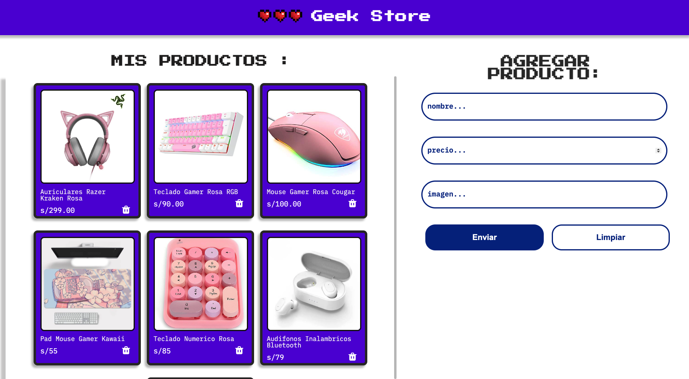

# Biblioteca Alura Geek



## Descripcion

Bienvenido/a al repositorio de la Biblioteca Alura Geek — una página web de ejemplo para una tienda comercial. El proyecto usa una API falsa basada en un archivo JSON (`database/db.json`) para simular datos durante el desarrollo.

## Contenido

- Descripción breve del proyecto
- Tecnologías usadas
- Cómo ejecutar el proyecto localmente
- Estructura del repositorio
- Cómo contribuir

## Características

- Listado y visualización de productos
- Formulario para crear/editar productos (simulado)
- Conexión a una API falsa mediante `db.json`

## Tecnologías


- **HTML5** → estructura semántica del sitio
- **CSS3** → estilos, layout y diseño responsive.  
- **JavaScript** → interactividad y conexión con la API Fake.  
- **JSON Server** → simulación de API para manejar productos.  
- **Vercel** → plataforma para despliegue y hosting del proyecto.


## Tabla de contenidos

1. [Instalación y ejecución local](#instalación-y-ejecución-local)
2. [Estructura del proyecto](#estructura-del-proyecto)
3. [Contribuir](#contribuir)
4. [Instalación y Uso](#Instalación-y-Uso)
5. [Autor](#Autor)

## Instalación y ejecución local

Requisitos mínimos: un navegador moderno. Opcionalmente puedes usar un servidor estático para evitar problemas de CORS al cargar recursos locales.

1. Clona el repositorio:

```bash
git clone https://github.com/luuzuriaga/AluraGeek.git
cd AluraGeek
```

2. Abrir directamente (opción rápida):

- Abre `index.html` en tu navegador.

3. Ejecutar con servidor estático (recomendado):

- Con Python 3:

```bash
python3 -m http.server 5500
# luego abre http://localhost:5500
```

- Con Node (http-server):

```bash
npm install -g http-server
http-server -p 5500
# luego abre http://localhost:5500
```

## Estructura del proyecto

Descripción rápida de los archivos y carpetas más importantes:

- `index.html` — página principal
- `package.json` — metadatos del proyecto (si aplica)
- `README.md` — este archivo
- `database/db.json` — datos de ejemplo (API fake)
- `estilos/` — CSS: `reset.css`, `styles.css`
- `imagenes/` — imágenes utilizadas en la web
- `js/` — scripts JS
  - `conexionApi.js` — funciones para interactuar con la API falsa
  - `mostrarProducto.js` — lógica para renderizar productos
  - `accionFormulario.js` — manejo del formulario

## Uso (rápido)

- Al abrir la página verás el listado de productos que provienen de `database/db.json` mediante las funciones en `js/conexionApi.js`.
- El formulario permite simular la creación/edición de productos (no persiste en una API real salvo que lo conectes a un backend).

## Contribuir

Si quieres contribuir:

1. Haz un fork del repositorio
2. Crea una rama con tu feature: `git checkout -b feature/nombre`
3. Haz commits pequeños y descriptivos
4. Abre un pull request explicando los cambios

Sugerencias de mejoras fáciles: añadir validaciones al formulario, conectar a una API real, agregar estilos responsivos o tests simples.

## Instalación y Uso

1. Clona el repositorio:
   ```bash
   git clone https://github.com/luuzuriaga/GeekStore.git

2.	Accede a la carpeta del proyecto:

    cd AluraGeek

3.	Instala las dependencias (si las hay):

    npx json-server --watch database/db.json --port 3000


## Autor
Desarrollado por Lucero Uzuriaga
📧 Contacto: lucero.uzuriaga2020@gmail.com


